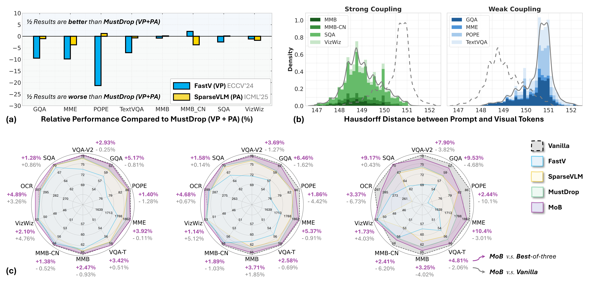

<div align="center">
  <h1>🧩 Multi‑Objective Balanced Covering (MoB) for Visual Token Pruning</h1>
  <p>
    <em>Official implementation of the NeurIPS 2025 paper:<br>
    <strong>“Why 1 + 1 < 1 in Visual Token Pruning: Beyond Naïve Integration via Multi‑Objective Balanced Covering”</strong></em>
  </p>

  <!-- Badges (customize as needed) -->
  <p>
    <a href="#"></a>
    <a href="#"></a>
    <a href="#"></a>
    <a href="#"></a>
  </p>
</div>

<p align="center">
  
</p>

> **TL;DR.** MoB is a training‑free, geometry‑aware pruning strategy that jointly optimizes **Prompt Alignment (PA)** and **Visual Preservation (VP)**. It delivers strong performance–latency trade‑offs (e.g., ~1.3–1.5× speed‑up on LLaVA‑Next‑7B with negligible loss), scales to advanced MLLMs (e.g., ~95% performance retained on Qwen2‑VL‑7B using only ~22% visual tokens), and is compatible with efficient attention operators.

---

## 🔥 News
- **2025‑05.** Public preprint released; codebase aligned with the NeurIPS 2025 paper.
- **2025‑06~09.** Reproducible evaluation via `lmms‑eval`; expanded configs for LLaVA‑1.5/Next‑7B and Qwen2‑VL‑7B.

---

## 👀 Overview
MoB reframes visual token pruning as **bi‑objective covering**. For an image–text pair, MoB selects a subset of visual tokens that (1) align to prompt semantics (**PA**) and (2) maintain geometric coverage of the visual manifold (**VP**). The retained set is computed in two phases per chosen layer **ℓ**:
1) **Prompt‑aligned selection** to fill the prompt budget **K_p**.
2) **Coverage expansion** via farthest‑point sampling to reach the total budget **K**.

MoB exposes a lightweight runtime interface (`MoB_config`) so users can choose: **where** to prune (layer index ℓ), **how many** tokens to keep (K), **how many** to devote to prompt alignment (K_p or its ratio), and the **covering fold k** (how many visual centers per prompt anchor). A coarse prior on prompt–visual coupling **η** further stabilizes budget choices (see **Configuration** below).

---

## 🛠 Preparation

### 1) Clone
```bash
git clone https://github.com/your‑org/MoB.git
cd MoB
```

### 2) Create environment
We recommend Python ≥ 3.10.
```bash
conda create -n mob python=3.10 -y
conda activate mob
```

### 3) Backends

#### LLaVA / LLaVA‑Next
```bash
cd LLaVA
pip install -e .
cd ..
```

#### Qwen2‑VL
```bash
cd Qwen2-VL/transformers && pip install -e .
pip install accelerate qwen-vl-utils[decord]
# (Optional) FlashAttention
pip install flash-attn --no-build-isolation
cd ../../lmms-eval && pip install -e .
cd ..
```

---

## 🎯 Usage

### A) LLaVA / LLaVA‑Next (inference demo)
```python
from llava.model.builder import load_pretrained_model

# Base checkpoint (example); use any LLaVA‑1.5/Next variant you prefer
model_path = "liuhaotian/llava-v1.6-vicuna-7b"

tokenizer, model, image_processor, _ = load_pretrained_model(
    model_path=model_path, model_base=None, model_name="llava-v1.6-mob"
)

# Example config (one of the paper‑evaluated settings)
model.config.MoB_config.update({
    "l_idx": 2,                 # prune at layer ℓ = 2
    "image_token_start_index": 35,
    "image_token_length": 576,  # LLaVA‑1.5 default patches
    "K": 64,                    # total keep budget
    "Kp_ratio": 0.5,            # i.e., K_p = 0.5 * K
    "k_ratio": 0.125,           # e.g., k ≈ K_p / 8
})
```
Run the standard LLaVA entry point (MoB kicks in automatically once `MoB_config` is set):
```bash
python -m llava.eval.run_llava \
  --model-path "$model_path" \
  --query "Describe the main differences between the two diagrams." \
  --image-file path/to/image.jpg
```

### B) Qwen2‑VL (chat demo)
```python
from Qwen2VL_MoB.modeling_qwen2_vl_self import MoB
from transformers import AutoTokenizer, AutoConfig

model_id = "Qwen/Qwen2-VL-7B-Instruct"
tokenizer = AutoTokenizer.from_pretrained(model_id, trust_remote_code=True)
config = AutoConfig.from_pretrained(model_id, trust_remote_code=True)

config.MoB_config = {
    "image_token_start_index": 1,
    "image_token_length": 256,
    "K": 64,             # choose per your latency target
    "Kp_ratio": 0.5,     # prompt‑alignment budget ratio
    "k_ratio": 0.125,    # covering fold as a ratio of K_p
    "alpha": 0.5,        # PA vs VP weighting (optional)
    "distance_metric": "cosine",  # or "euclidean"
}

model = MoB.from_pretrained(model_id, config=config, trust_remote_code=True, torch_dtype="auto")

result = model.chat(tokenizer, query="What safety hazards does this blueprint reveal?", image=image_tensor)
print(result)
```

### C) Benchmarking with `lmms‑eval`
```bash
cd lmms_eval
pip install -e .
cd ..

lmms-eval \
  --model llava-v1.6-mob \
  --tasks scienceqa_img \
  --batch-size 1 \
  --log-retained-patches
```
The customized evaluator records retained patch indices per sample for auditing.

---

## ⚙️ Configuration (K, K_p, k, and η‑prior)
MoB offers two simple scheduling modes:

- **Without η‑prior** (benchmark‑agnostic): choose **K_p** and **k** as functions of **K** only. A practical grid is
  - K ∈ {64, 128, 192}, with matching K_p ∈ {32, 48, 64} and k ∈ {4, 6, 8} (yields ≈66.7–88.9% reduction).
- **With η‑prior** (benchmark‑aware): partition tasks into **strong** vs **weak** prompt–visual coupling and reuse a few shared settings.
  - *Strong coupling*: K_p ∈ {3K/8, K/4, 11K/24}, with k ≈ 3K_p/40.
  - *Weak coupling*: K_p ∈ {K/2, 7K/16, 5K/12}, with k ≈ K_p/8.

> **Tip.** The pruning layer is typically **ℓ = 2** for both image and video models. If your prompts are very long, increasing **K_p** (and thus **k**) often helps; returns diminish as **K** grows.

---

## 📈 Results at a Glance
- **Performance–latency**: ~**1.3–1.5×** speed‑up on **LLaVA‑Next‑7B** with negligible loss.
- **Retention under heavy pruning**: ~**95%** performance on **Qwen2‑VL‑7B** using only **~22%** of visual tokens.
- **Video**: Extends to Video‑LLMs with strong trade‑offs at ~6–7% token keep rates.

(See the paper for detailed tables, ablations over ⟨K, K_p, k⟩, and η‑prior.)

---

## 📂 Repository Structure
```
MoB/
├── LLaVA/                # MoB‑enabled LLaVA backend (training, inference, evaluation)
├── LLaVA-Next/           # Extended LLaVA‑Next models with MoB hooks
├── Qwen2‑VL/             # Qwen2‑VL integration with balanced covering
├── lmms_eval/            # Evaluation toolkit with MoB logging
├── images/               # Figures for paper/README
└── README.md             # You are here
```

---

## 📜 Citation
If you find MoB useful, please cite our paper:
```bibtex
@article{li2025mob,
  title   = {Why 1 + 1 < 1 in Visual Token Pruning: Beyond Naïve Integration via Multi‑Objective Balanced Covering},
  author  = {Yangfu Li and Hongjian Zhan and Tianyi Chen and Qi Liu and Yue Lu},
  year    = {2025},
  eprint  = {2505.10118},
  archivePrefix = {arXiv},
  primaryClass  = {cs.CV}
}
```

---

## 🙏 Acknowledgements & 🔑 License
- Built on the shoulders of open‑source MLLMs (e.g., LLaVA, Qwen2‑VL) and the `lmms‑eval` ecosystem.
- Released under the **MIT License** (see `LICENSE`).

